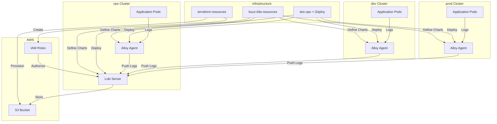
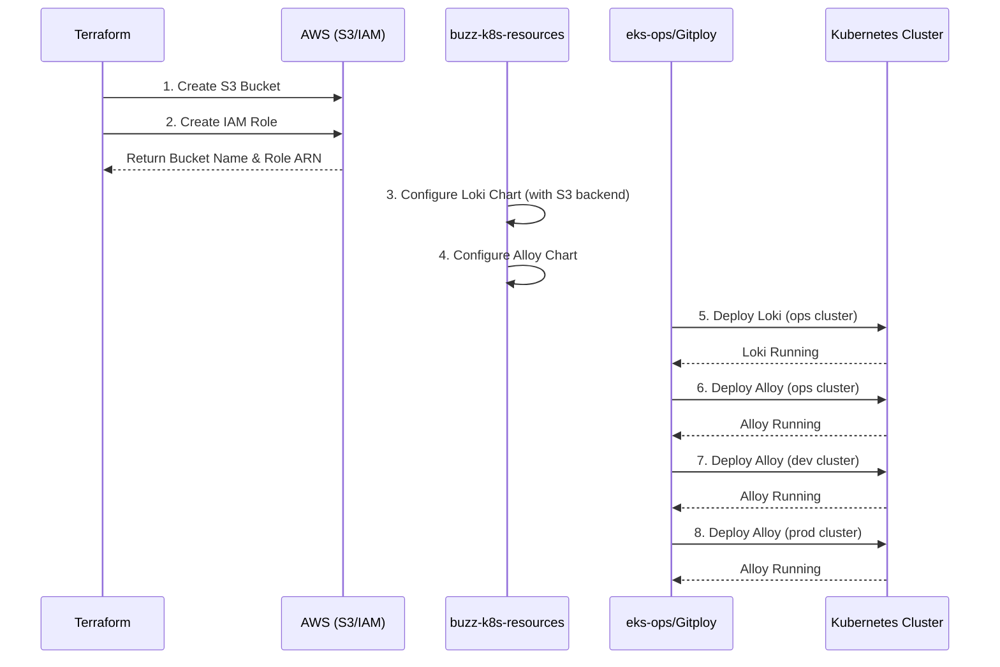

# Design Document

## Overview

이 시스템은 Kubernetes 환경에서 중앙화된 로그 수집 및 저장 솔루션을 구축합니다. Loki를 중앙 로그 저장소로 사용하고, Alloy 에이전트를 각 클러스터(ops, dev, prod)에 배포하여 로그를 수집합니다. S3를 장기 저장소로 활용하며, 멀티테넌시를 통해 팀별 로그 격리를 보장합니다.

**핵심 구성 요소:**
- **Loki**: 로그 수집 및 쿼리 엔진 (S3 백엔드)
- **Alloy**: 각 클러스터의 로그 수집 에이전트
- **S3**: 로그 장기 저장소
- **Terraform**: 인프라 프로비저닝
- **Helm**: Kubernetes 애플리케이션 패키징
- **Gitploy**: GitOps 기반 배포 자동화

## Architecture

### High-Level Architecture



### Deployment Flow



## Components and Interfaces

### 1. Terraform Infrastructure Module

**Purpose**: S3 버킷과 IAM 역할을 프로비저닝

**Key Resources**:
- `aws_s3_bucket`: Loki 로그 저장용 버킷
- `aws_s3_bucket_versioning`: 버전 관리 활성화
- `aws_s3_bucket_lifecycle_configuration`: 로그 보관 정책
- `aws_iam_role`: Loki가 사용할 서비스 역할
- `aws_iam_policy`: S3 읽기/쓰기 권한 정책
- `aws_iam_role_policy_attachment`: 역할에 정책 연결

**Outputs**:
```hcl
output "loki_s3_bucket_name" {
  value = aws_s3_bucket.loki_logs.id
}

output "loki_iam_role_arn" {
  value = aws_iam_role.loki.arn
}
```

### 2. Loki Helm Chart Configuration

**Purpose**: Loki 서버를 Kubernetes에 배포

**Key Configuration** (`values.yaml`):
```yaml
loki:
  auth_enabled: true  # 멀티테넌시 활성화
  
  storage:
    type: s3
    bucketNames:
      chunks: <from-terraform-output>
      ruler: <from-terraform-output>
    s3:
      region: <aws-region>
      
  schemaConfig:
    configs:
      - from: 2024-01-01
        store: tsdb
        object_store: s3
        schema: v13
        
  limits_config:
    split_queries_by_interval: 24h
    max_query_parallelism: 32
    
serviceAccount:
  annotations:
    eks.amazonaws.com/role-arn: <from-terraform-output>
```

**Multitenancy Configuration**:
- `auth_enabled: true`: X-Scope-OrgID 헤더 필수
- 테넌트별 격리: ops, dev, prod

### 3. Alloy Helm Chart Configuration

**Purpose**: 각 클러스터에서 로그 수집

**Key Configuration** (`values.yaml`):
```yaml
alloy:
  configMap:
    content: |
      loki.write "default" {
        endpoint {
          url = "http://loki-gateway/loki/api/v1/push"
          tenant_id = "<cluster-name>"  # ops, dev, or prod
        }
      }
      
      loki.source.kubernetes "pods" {
        targets    = discovery.kubernetes.pods.targets
        forward_to = [loki.write.default.receiver]
      }
      
      discovery.kubernetes "pods" {
        role = "pod"
      }

  resources:
    requests:
      cpu: 100m
      memory: 128Mi
    limits:
      cpu: 500m
      memory: 512Mi
```

### 4. Gitploy Deployment Trigger

**Purpose**: 각 클러스터로의 배포 트리거

**Deployment Flow**:
1. buzz-k8s-resources에 Helm 차트 준비
2. Gitploy를 통해 배포 트리거
3. 대상 클러스터(ops/dev/prod) 선택
4. Helm 차트가 선택된 클러스터에 배포됨
5. kubectl로 배포 상태 확인

### 5. Monitoring and Validation Tools

**kubectl Commands**:
```bash
# Loki 상태 확인
kubectl get pods -n loki
kubectl logs -n loki <loki-pod>

# Alloy 상태 확인
kubectl get pods -n alloy
kubectl logs -n alloy <alloy-pod>
```

**Loki Query (LogQL)**:
```bash
# CLI 또는 API 사용
curl -G -s "http://loki:3100/loki/api/v1/query_range" \
  --data-urlencode 'query={namespace="default"}' \
  -H "X-Scope-OrgID: ops"
```

**AWS CLI**:
```bash
# S3 객체 확인
aws s3 ls s3://<bucket-name>/loki/

# 객체 다운로드
aws s3 cp s3://<bucket-name>/loki/<object-key> -
```

## Data Models

### Log Entry Structure

```json
{
  "timestamp": "2024-01-15T10:30:00Z",
  "stream": {
    "namespace": "default",
    "pod": "app-xyz-123",
    "container": "main",
    "cluster": "ops"
  },
  "values": [
    ["1705318200000000000", "Log message content"]
  ]
}
```

### Tenant Model

```yaml
tenants:
  - id: ops
    description: Operations cluster logs
    retention: 30d
  - id: dev
    description: Development cluster logs
    retention: 7d
  - id: prod
    description: Production cluster logs
    retention: 90d
```

### Cost Tracking Model

```json
{
  "resource": "loki",
  "cluster": "ops",
  "date": "2024-01-15",
  "metrics": {
    "s3_storage_gb": 150.5,
    "s3_requests": 1000000,
    "compute_hours": 720,
    "data_transfer_gb": 50.2
  },
  "cost_usd": 125.50
}
```

## Correctness Properties

*A property is a characteristic or behavior that should hold true across all valid executions of a system-essentially, a formal statement about what the system should do. Properties serve as the bridge between human-readable specifications and machine-verifiable correctness guarantees.*


### Property 1: IAM 정책 권한 완전성
*For any* IAM Role 정책 문서, S3 버킷에 대한 읽기 권한(s3:GetObject, s3:ListBucket)과 쓰기 권한(s3:PutObject)이 모두 포함되어야 한다
**Validates: Requirements 1.3**

### Property 2: 시간 범위 쿼리 정확성
*For any* 유효한 시간 범위(start, end), Loki 쿼리 결과로 반환되는 모든 로그의 타임스탬프는 해당 범위 내에 있어야 한다
**Validates: Requirements 8.2**

### Property 3: 테넌트 격리 보장
*For any* 테넌트 ID, 해당 테넌트로 Loki를 쿼리했을 때 반환되는 모든 로그는 동일한 테넌트 ID를 가져야 한다
**Validates: Requirements 8.3**

### Property 4: 로그 저장 지연 감지
*For any* S3 버킷의 최신 로그 객체, 객체의 생성 시간과 현재 시간의 차이가 허용 임계값(예: 5분)을 초과하면 지연으로 판단되어야 한다
**Validates: Requirements 9.4**

### Property 5: 로그 수집 완전성 검증
*For any* 시간 구간, 예상 로그 라인 수 대비 실제 수집된 로그 라인 수의 비율이 계산되고, 이 비율이 임계값(예: 95%) 미만이면 알림이 발송되고 누락 소스가 식별되어야 한다
**Validates: Requirements 10.1, 10.2, 10.3, 10.4**

### Property 6: Loki 비용 집계 정확성
*For any* Loki 관련 리소스 비용 데이터 집합, 집계된 총 비용은 개별 비용의 합과 일치해야 한다
**Validates: Requirements 4.1**

### Property 7: Loki 비용 임계값 알림
*For any* 비용 데이터, 총 비용이 설정된 임계값을 초과하면 알림이 발송되어야 한다
**Validates: Requirements 4.2**

### Property 8: Loki 비용 리포트 구조
*For any* 비용 리포트 요청, 생성된 리포트는 일별(daily), 주별(weekly), 월별(monthly) 비용 데이터를 모두 포함해야 한다
**Validates: Requirements 4.3**

### Property 9: Alloy 비용 집계 정확성
*For any* Alloy 관련 리소스 비용 데이터 집합, 집계된 총 비용은 개별 비용의 합과 일치해야 한다
**Validates: Requirements 11.1**

### Property 10: Alloy 비용 임계값 알림
*For any* Alloy 비용 데이터, 총 비용이 설정된 임계값을 초과하면 알림이 발송되어야 한다
**Validates: Requirements 11.2**

### Property 11: Alloy 비용 클러스터별 분석
*For any* 클러스터별 비용 리포트 요청, 생성된 리포트는 각 클러스터(ops, dev, prod)별로 비용이 그룹화되어 있어야 한다
**Validates: Requirements 11.3**

## Error Handling

### Infrastructure Provisioning Errors

**Terraform Failures**:
- S3 버킷 이름 충돌: 고유한 버킷 이름 생성 (prefix + random suffix)
- IAM 권한 부족: 필요한 권한을 문서화하고 사전 검증
- 리소스 할당량 초과: 할당량 증가 요청 또는 기존 리소스 정리

**Error Response**:
```hcl
output "error" {
  value = "Failed to create S3 bucket: ${error_message}"
}
```

### Deployment Errors

**Helm Chart Failures**:
- 잘못된 values 파일: Helm lint로 사전 검증
- 리소스 부족: 리소스 요청량 조정 또는 노드 추가
- 이미지 pull 실패: 이미지 레지스트리 접근 권한 확인

**Gitploy Trigger Failures**:
- 배포 트리거 실패: Gitploy 연결 상태 확인 및 재시도
- 클러스터 접근 실패: kubeconfig 및 인증 정보 검증
- 권한 오류: ServiceAccount 권한 검증

**Recovery Strategy**:
```bash
# Rollback to previous version
helm rollback loki -n loki

# Check deployment status
kubectl rollout status deployment/loki -n loki
```

### Runtime Errors

**Loki Errors**:
- S3 연결 실패: IAM Role 권한 및 네트워크 연결 확인
- 쿼리 타임아웃: 쿼리 범위 축소 또는 인덱스 최적화
- 메모리 부족: 리소스 제한 증가 또는 샤딩 설정

**Error Response**:
```json
{
  "status": "error",
  "error": "failed to query storage: context deadline exceeded",
  "errorType": "timeout"
}
```

**Alloy Errors**:
- Loki 엔드포인트 연결 실패: 네트워크 정책 및 서비스 엔드포인트 확인
- 로그 수집 실패: Pod 로그 접근 권한(RBAC) 확인
- 버퍼 오버플로우: 버퍼 크기 증가 또는 전송 속도 조정

**Error Logging**:
```yaml
# Alloy error log format
{
  "level": "error",
  "ts": "2024-01-15T10:30:00Z",
  "msg": "failed to send logs to Loki",
  "error": "connection refused",
  "target": "http://loki-gateway/loki/api/v1/push"
}
```

### Monitoring and Alerting

**Alert Rules**:
```yaml
alerts:
  - name: LokiDown
    condition: up{job="loki"} == 0
    duration: 5m
    severity: critical
    
  - name: AlloyCollectionFailed
    condition: rate(alloy_logs_failed_total[5m]) > 0.1
    duration: 5m
    severity: warning
    
  - name: S3StorageFailed
    condition: rate(loki_s3_request_duration_seconds_count{status_code=~"5.."}[5m]) > 0.05
    duration: 5m
    severity: critical
    
  - name: LogCollectionGap
    condition: (expected_logs - actual_logs) / expected_logs > 0.05
    duration: 10m
    severity: warning
```

## Testing Strategy

### Unit Testing

**Infrastructure Tests** (Terraform):
- S3 버킷 생성 검증
- IAM Role 및 정책 생성 검증
- Output 값 검증

**Configuration Tests** (Helm):
- values.yaml 파싱 및 검증
- 멀티테넌시 설정 확인
- 환경별 values 파일 검증

**Tools**: `terraform validate`, `terraform plan`, `helm lint`, `helm template`

### Integration Testing

**Deployment Tests**:
- Helm 차트 배포 성공 여부
- Pod 상태 확인 (Running)
- 서비스 엔드포인트 접근성

**End-to-End Tests**:
- Alloy → Loki → S3 로그 파이프라인
- 테넌트별 로그 격리 검증
- 로그 쿼리 및 조회

**Tools**: `kubectl`, `curl`, `aws cli`

### Property-Based Testing

**Framework**: Python의 `hypothesis` 라이브러리를 사용합니다.

**Configuration**:
- 각 property 테스트는 최소 100회 반복 실행
- 각 테스트는 설계 문서의 property 번호를 명시적으로 참조

**Test Structure**:
```python
from hypothesis import given, strategies as st
import pytest

# Feature: loki-alloy-deployment, Property 1: IAM 정책 권한 완전성
@given(st.from_type(IAMPolicyDocument))
def test_iam_policy_completeness(policy_doc):
    """Validates: Requirements 1.3"""
    required_actions = ['s3:GetObject', 's3:ListBucket', 's3:PutObject']
    policy_actions = extract_actions(policy_doc)
    assert all(action in policy_actions for action in required_actions)

# Feature: loki-alloy-deployment, Property 2: 시간 범위 쿼리 정확성
@given(
    start=st.datetimes(),
    end=st.datetimes(),
    logs=st.lists(st.from_type(LogEntry))
)
def test_time_range_query_accuracy(start, end, logs):
    """Validates: Requirements 8.2"""
    if start > end:
        start, end = end, start
    
    filtered_logs = query_loki_time_range(start, end, logs)
    for log in filtered_logs:
        assert start <= log.timestamp <= end

# Feature: loki-alloy-deployment, Property 3: 테넌트 격리 보장
@given(
    tenant_id=st.text(min_size=1, max_size=20),
    logs=st.lists(st.from_type(LogEntry))
)
def test_tenant_isolation(tenant_id, logs):
    """Validates: Requirements 8.3"""
    filtered_logs = query_loki_by_tenant(tenant_id, logs)
    for log in filtered_logs:
        assert log.tenant_id == tenant_id

# Feature: loki-alloy-deployment, Property 5: 로그 수집 완전성 검증
@given(
    expected_count=st.integers(min_value=1000, max_value=100000),
    actual_count=st.integers(min_value=0, max_value=100000),
    threshold=st.floats(min_value=0.8, max_value=0.99)
)
def test_log_collection_completeness(expected_count, actual_count, threshold):
    """Validates: Requirements 10.1, 10.2, 10.3, 10.4"""
    collection_rate = actual_count / expected_count if expected_count > 0 else 0
    
    if collection_rate < threshold:
        alert = check_collection_alert(expected_count, actual_count, threshold)
        assert alert.triggered is True
        assert alert.missing_sources is not None

# Feature: loki-alloy-deployment, Property 6: Loki 비용 집계 정확성
@given(st.lists(st.from_type(CostData), min_size=1))
def test_loki_cost_aggregation(cost_data_list):
    """Validates: Requirements 4.1"""
    aggregated = aggregate_loki_costs(cost_data_list)
    expected_total = sum(item.cost for item in cost_data_list)
    assert abs(aggregated.total_cost - expected_total) < 0.01

# Feature: loki-alloy-deployment, Property 7: Loki 비용 임계값 알림
@given(
    cost=st.floats(min_value=0, max_value=10000),
    threshold=st.floats(min_value=100, max_value=5000)
)
def test_loki_cost_threshold_alert(cost, threshold):
    """Validates: Requirements 4.2"""
    alert = check_cost_alert(cost, threshold, resource_type="loki")
    if cost > threshold:
        assert alert.triggered is True
    else:
        assert alert.triggered is False
```

**Property Test Coverage**:
- Property 1: IAM 정책 권한 완전성
- Property 2: 시간 범위 쿼리 정확성
- Property 3: 테넌트 격리 보장
- Property 4: 로그 저장 지연 감지
- Property 5: 로그 수집 완전성 검증
- Property 6-11: 비용 모니터링 관련 properties

### Manual Testing

**Verification Checklist**:
- [ ] Terraform으로 S3 버킷 생성 확인
- [ ] IAM Role 권한 확인
- [ ] Loki Pod 정상 실행 확인
- [ ] Alloy Pod 정상 실행 확인 (ops, dev, prod)
- [ ] Loki에서 로그 쿼리 성공 확인
- [ ] S3에 로그 파일 저장 확인
- [ ] 테넌트별 로그 격리 확인
- [ ] 비용 모니터링 대시보드 확인

## Implementation Notes

### Prerequisites

**Required Tools**:
- Terraform >= 1.5.0
- Helm >= 3.12.0
- kubectl >= 1.27.0
- AWS CLI >= 2.13.0
- Python >= 3.10 (for testing)

**Required Access**:
- AWS 계정 (S3, IAM 권한)
- Kubernetes 클러스터 접근 (ops, dev, prod)
- GitHub 리포지토리 접근 (terraform-resources, buzz-k8s-resources, eks-ops)

### Configuration Management

**Environment Variables**:
```bash
# AWS
export AWS_REGION=ap-northeast-2
export LOKI_S3_BUCKET_NAME=<from-terraform>
export LOKI_IAM_ROLE_ARN=<from-terraform>

# Kubernetes
export KUBECONFIG_OPS=~/.kube/config-ops
export KUBECONFIG_DEV=~/.kube/config-dev
export KUBECONFIG_PROD=~/.kube/config-prod

# Loki
export LOKI_ENDPOINT=http://loki-gateway.loki.svc.cluster.local
```

**Secrets Management**:
- AWS credentials: IAM Role for Service Account (IRSA)
- Loki tenant credentials: Kubernetes Secrets
- Cost monitoring API keys: External Secrets Operator

### Deployment Order

1. **Phase 1: Infrastructure** (ops cluster)
   - Terraform: S3 + IAM
   - Helm: Loki chart
   - Gitploy: Deploy Loki
   - Verify: Loki health check

2. **Phase 2: Log Collection** (ops cluster)
   - Helm: Alloy chart
   - Gitploy: Deploy Alloy
   - Verify: Logs in Loki

3. **Phase 3: Expansion** (dev cluster)
   - Helm: Alloy chart (dev values)
   - Gitploy: Deploy Alloy
   - Verify: Dev logs in Loki

4. **Phase 4: Production** (prod cluster)
   - Helm: Alloy chart (prod values)
   - Gitploy: Deploy Alloy
   - Verify: Prod logs in Loki

5. **Phase 5: Monitoring**
   - Implement cost tracking
   - Set up alerting
   - Verify log collection completeness

### Rollback Strategy

**Helm Rollback**:
```bash
# List releases
helm list -n loki

# Rollback to previous version
helm rollback loki -n loki

# Rollback to specific revision
helm rollback loki 3 -n loki
```

**Terraform Rollback**:
```bash
# Revert to previous state
terraform state pull > backup.tfstate
terraform apply -state=previous.tfstate
```

### Monitoring and Observability

**Key Metrics**:
- Loki: `loki_ingester_chunks_created_total`, `loki_request_duration_seconds`
- Alloy: `alloy_logs_sent_total`, `alloy_logs_failed_total`
- S3: `s3_request_duration_seconds`, `s3_object_count`
- Cost: `daily_cost_usd`, `monthly_cost_usd`

**Dashboards**:
- Loki Operations Dashboard
- Alloy Collection Dashboard
- Cost Tracking Dashboard
- Log Volume Dashboard

**Log Retention**:
- ops: 30 days
- dev: 7 days
- prod: 90 days
